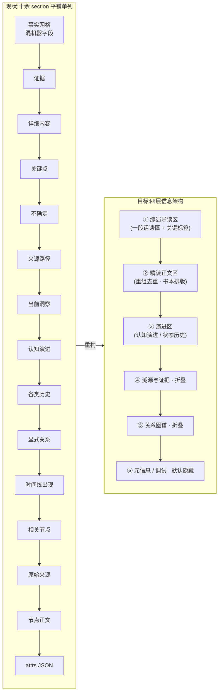

# Wiki 详情页阅读优化 PRD

## 一、文档信息

| 项目 | 内容 |
| --- | --- |
| 文档名称 | Wiki 详情页「阅读态重组 + 书本式布局」优化方案 |
| 版本 | v0.1（草稿，待评审） |
| 作者 | 郑焕 |
| 创建日期 | 2026-08-11 |
| 状态 | 待确认 |
| 关联代码 | `src/second_memory/wiki.py`、`src/second_memory/templates/wiki.html`、`src/second_memory/models.py`、`src/second_memory/topics.py` |
| 参考产物 | `~/.second-memory/wiki-v24-real-copy-agent-rebuilt-20260810.html` |
| 参考知识库 | `~/.second-memory/knowledge-base-v24-agent-rebuild-20260810/` |

---

## 二、背景与问题

第二记忆库通过 `second-memory wiki` 把编译后的实体（entity）、事件（event）、洞察（statement）、主题（topic）与原文（raw）导出为单文件 HTML。当前详情页由 [templates/wiki.html](../src/second_memory/templates/wiki.html) 的 `renderNode` 渲染，内容来自编译层节点的 `content`（`summary` / `detail` / `key_points` / `evidence` / `uncertainties`）与语义字段。

现状是：**详情页更像「把我的记录原样整理堆在一起」，而不是「关于这个节点的一份可读总结」**。点开一个节点后信息凌乱、主次不分、阅读负担重。基于对真实产物与知识库文件的逐一核对，问题归纳为四类。

### 问题 1：内容重复堆叠，不是总结

同一层意思在多个字段里反复出现，详情页把它们平铺并列，读者要自己拼出「这节点到底讲什么」。

> 数据来源：`wiki/statements/statement-失败羞耻会推动规划代替行动.md`
>
> - `current_state`：「用户把规划回避进一步追溯到维护强者形象：不做能暂时避免失败和失去尊重，却持续减少现实反馈与落地经验。」
> - `evolution` 最后一条 `state`：与上一句**几乎逐字相同**。
> - `key_points` 中有一条：「真正行动会暴露能力、方法与现实的差距，为避免人格否定，容易停留在规划、优化和等待更有把握的状态。」——这句是直接**复制自 `detail` 的原句**。
>
> 结果：详情页「关键点」「当前洞察」「认知演进」三个区块内容互相打架、重复阅读。

### 问题 2：机器 / 调试字段直接暴露给人

面向溯源与调试的字段和正文平级铺开，对阅读是纯噪音。

> 数据来源：`renderNode`（`templates/wiki.html:483-541`）
>
> - `fact-grid` 混入 `Aliases` / `Created` / `Updated` / `事实性 · confidence` / `时间精度` 等机器元信息。
> - 底部 `节点 attrs` 折叠出原始 JSON。
> - 满屏 `raw-20260810-2105-d4ac4dd8` 这类内部 id（`detail-id`、来源标注）。
> - 显式关系区用英文边类型：`about` / `supports` / `contrasts` / `contains` / `involves`。

### 问题 3：缺少「一眼读懂」的主阅读区，正文与溯源无主次

`detail` 字段（V2.4 契约强制的多段综合，见 `models.py` 的 `CONTENT_DETAIL_LABELS`）其实写得不差，但它只是详情页十余个并列 `section` 中的一个；`sources`、`evidence` 出处、`显式关系`、`出现在时间线`、`相关节点` 等溯源信息与正文平级排布，不断打断阅读。

> 数据来源：`renderNode` 依次 append 的 section 顺序（`templates/wiki.html:507-536`）——事实网格 → 证据 → 详细内容 → 关键点 → 不确定信息 → 来源路径 → 当前洞察 → 认知演进 → 各类历史 → 显式关系 → 时间线出现 → 相关节点 → 原始来源 → 节点正文 → attrs。**没有任何分层，全部平铺单列。**

### 问题 4：主题详情过载，长流无目录

topic 详情把 `topic_contract` 每个成员的 `reason + supporting_excerpt` 全量展开，读者只能一路下滚，找不到落脚点。

> 数据来源：`wiki/topics/topic-逃避机制与主体感恢复.md`
>
> 该主题 `attrs.topic_contract.member_rationales` 含 **24 个成员合同**，每个都渲染出「理由 + 依据摘录」两行；叠加 `topic_reading`（核心理解、7 条演变、开放问题）、`facets`、`exclusions`、`证据`、`详细内容`、`关键点`……单页极长且无跳转目录。

---

## 三、目标与非目标

### 目标

1. **内容目标**：点开详情后，先看到「关于这个节点的一段凝练总结」，再往下是有主次、去重后的精读正文。所有信息保留，但按「先读懂、再溯源、后调试」分层组织。
2. **阅读目标**：详情页像一本书——单列、窄阅读宽度、阅读字体与舒适行距、左侧浮动目录（TOC）可跳转、次要信息默认折叠。
3. **约束目标**：不删除任何原有内容，新增内容仅作为「加强」；溯源、证据、关系、演进等既有价值信息以更友好的 UI 呈现或折叠，而非丢弃。

### 非目标

1. 不从 `raw/` 原文从 0 重新编译知识图谱（不重放 raw、不重抽取 mentions/occurrences/claims）。
2. 不改动 `raw/` 正文、`evidence` 出处、显式 `edges`、`evolution` 历史、timeline 投影等既有结构化数据。
3. 不引入数据库、后台服务或网络请求；`wiki` 仍是确定性、离线、单文件导出。
4. 本期不改 `概览` / `时间线` / `图谱列表` / `原文` 等列表视图的信息架构（仅在必要处对齐视觉），聚焦**详情页**。

---

## 四、关键决策（已与用户确认）

| 决策项 | 结论 |
| --- | --- |
| 内容优化路径 | **展示层 + 编译层双管齐下**。但编译层**不从原料层从 0 编译**，而是「将详情页重新编译一次」——基于现有节点内容做**内容重组优化**（去重、凝练、分层），产出阅读态字段。 |
| 详情页布局 | **书本式单列 + 左侧浮动目录（TOC）**。顶部综述卡 → 精读正文 → 演进 → 溯源与证据（折叠）→ 关系图谱（折叠）→ 元信息（默认隐藏）。 |
| 原内容处理 | **只增强、不删除**。原 `detail` / `key_points` / `evidence` 等全部保留，精读区用重组后的阅读态内容，原始综合可在「完整综合」折叠内查看。 |
| PRD 落点 | 先出本地 Markdown 草稿留档，再同步到飞书个人空间根目录。 |

---

## 五、总体方案

分两条工作流，可独立交付、组合验收。

- **工作流 A — 详情页阅读态重编译（编译层）**：解决「内容是堆砌不是总结」。
- **工作流 B — 书本式详情页（展示层）**：解决「布局凌乱不像读书」。

### 信息架构：现状 vs 目标



### 字段映射：现有数据落到哪一层

| 现有字段 | 目标展示层 | 呈现方式 |
| --- | --- | --- |
| `reading.tldr`（新增） | ① 综述导读 | 顶部综述卡首句，一段话读懂 |
| `summary` | ① 综述导读 | 与 tldr 合并去重；作为副题 |
| `reading.narrative`（新增） | ② 精读正文 | 书本式主正文（重组去重后） |
| `detail`（原始综合） | ② 精读正文 | 「完整综合」折叠内保留原文 |
| `reading.highlights`（新增） | ② 精读正文 | 去重后的要点，正文内嵌 |
| `key_points`（原始） | ② 精读正文 | 「完整要点」折叠内保留原文 |
| `current_state` / `evolution` | ③ 演进 | 洞察演进时间轴（去重末条与 current_state） |
| `status_history` / `date_history` | ③ 演进 | 事件状态 / 日期时间轴 |
| `evidence` / `semantics.evidence` | ④ 溯源与证据（折叠） | 折叠区，claim + 来源 chip |
| `uncertainties` | ④ 溯源与证据（折叠） | 折叠区「仍不确定」 |
| `sources` / `source_groups` | ④ 溯源与证据（折叠） | 折叠区来源路径 |
| `outgoing` / `incoming` / `related` | ⑤ 关系图谱（折叠） | 折叠区，边类型显示中文 |
| `timeline_appearances` | ⑤ 关系图谱（折叠） | 折叠区时间线出现 |
| `id` / `created` / `updated` / `confidence` / `time_precision` / `attrs` | ⑥ 元信息（默认隐藏） | 页脚或「元信息」折叠，机器字段集中收纳 |

---

## 六、工作流 A：详情页阅读态重编译（编译层）

### 6.1 定位与复用

新增一次**只读现有节点、不重放 raw**的「阅读态重组」编译，产出面向人类阅读的凝练总结字段，写回节点。此过程**复用现有 `topics` refresh 的两阶段范式**（见 [topics.py](../src/second_memory/topics.py)）：

- `topics --emit-request` / `--apply-response` 已经证明「基于全库节点详情原子替换、不重放 raw」的模式成立（README「Consolidation / 维护调度」章节）。
- 本工作流沿用同一骨架：`emit-request` 打包现有节点的 `content` 给宿主 Agent → Agent 产出阅读态字段 → `apply-response` 原子写回。

建议命令名：`second-memory reading`（工作名，最终以实现为准）。

```bash
second-memory reading --emit-request --json
printf '%s' "$READING_PLAN_JSON" | second-memory reading --apply-response --stdin --json
```

### 6.2 新增数据模型：`reading` 阅读态

在节点 `content` 下新增 `reading` 子结构（或平级 `attrs.reading`，以最小侵入为准）。**仅新增，不改既有字段**。

```jsonc
{
  "reading": {
    "tldr": "一段话总结:这个节点是什么、为什么值得记、当下指向什么。40-120 字。",
    "narrative": "重组后的精读正文。多段连贯叙事,而非字段拼接:是什么 → 为什么 → 如何演变 → 当下指向。",
    "highlights": ["去重后的 2-4 条要点,不与 narrative 逐字重复"],
    "reading_version": "r1",
    "source_fields": ["summary", "detail", "key_points", "current_state", "evolution"]
  }
}
```

- `tldr`：综述导读区首句。让人一眼读懂。
- `narrative`：精读正文。**由现有 `summary` / `detail` / `key_points` / `current_state` / `evolution` 重组而来**，去掉重复、补上逻辑连接，形成可独立阅读的连贯段落。
- `highlights`：去重后的要点，用于正文内嵌高亮，禁止逐字复制 `narrative` 或 `detail` 的整句。
- `reading_version`：阅读态版本号，便于后续增量重跑与漂移检测。

### 6.3 内容优化规范（重组规则）

Agent 在重编译时须遵守以下规则，**目标是「总结」而非「扩写」或「搬运」**：

1. **去重优先**：`current_state` 与 `evolution` 末条重复时，`narrative` 只保留一处、以演进视角表达；`key_points` 与 `detail` 逐句重复的条目，在 `highlights` 中改写或剔除。
2. **重组成叙事**：把并列的「洞察与依据 / 演进与影响」两段，重组为「是什么 → 为什么 → 怎么演变 → 当下指向」的连贯读物，允许合并同类、调整语序。
3. **保真不发明**：`reading` 只能来自节点自身既有 `content` / `evidence` / `evolution`，**不得引入原文中不存在的新事实或新结论**；这是与「不重放 raw」一致的红线。
4. **分类适配**：
   - entity：突出「这是什么对象、和用户什么关系、当前状态」。
   - event：突出「什么时候发生了什么、结果与影响、还有什么没定论」。
   - statement：突出「核心洞察、依据、如何演变、当下指向」。
   - topic：`tldr` = 核心理解精炼；`narrative` 综述跨记录脉络；成员合同**默认折叠**，仅在关系层按 facet 分组展示，不再逐条平铺 24 段。
5. **长度纪律**：`tldr` 40-120 字；`narrative` 不设上限但须比原 `detail` 更凝练、无冗余；`highlights` 2-4 条。

### 6.4 不变量（apply 校验）

`apply-response` 必须拒绝越界写入，保证只增强、不破坏：

- 只允许写入 `reading` 子结构与 `reading_version`；**禁止修改** `summary` / `detail` / `key_points` / `evidence` / `uncertainties` / `current_state` / `evolution` / `semantics` / `out_edges` / `sources`。
- 不新增、删除或改写任何 `edges`、`raw`、`timeline`、`topic_contract`、`topic_reading`。
- 沿用现有 session 指纹机制拒绝过期响应（对齐 `topics` / `update` 的 apply 校验）。
- `reading` 缺失或校验失败时，详情页**回退**到现有 `detail` 渲染（保证向后兼容，见 6.5）。

### 6.5 向后兼容与降级

- 老知识库无 `reading` 字段时，展示层自动回退：综述区用 `summary`，精读区用 `detail`，与今天行为一致。
- `reading` 与 `detail` 同时存在时，精读区以 `narrative` 为主体，`detail` 收入「完整综合」折叠——**原内容永不丢失**，只是让位给更易读的重组版。

---

## 七、工作流 B：书本式详情页（展示层）

### 7.1 信息分层（四层 + 元信息）

所有节点类型详情页统一为下述纵向结构，**核心区默认展开，其余折叠或隐藏**：

| 层 | 区块 | 默认状态 | 内容 |
| --- | --- | --- | --- |
| ① | 综述导读 | 展开 | 类型标签 + 标题 + `tldr` 综述 + 关键标签（如置信度、状态、日期，去机器术语） |
| ② | 精读正文 | 展开 | `narrative` 书本正文 + `highlights` 内嵌要点；「完整综合 / 完整要点」折叠保留原文 |
| ③ | 演进 | 展开（有则显示） | 认知演进（statement）/ 状态·日期历史（event）时间轴 |
| ④ | 溯源与证据 | 折叠 | evidence、uncertainties、sources、entity 来源路径 |
| ⑤ | 关系图谱 | 折叠 | 出边 / 反向关联（中文边类型）、相关节点、时间线出现；topic 的成员按 facet 分组 |
| ⑥ | 元信息 / 调试 | 默认隐藏 | id、created/updated、confidence、time_precision、attrs JSON |

### 7.2 布局线框（书本式单列 + 浮动目录）

```
┌───────────────────────────────────────────────────────┐
│  忆  第二记忆        主题 · 概览 · 时间线 · 图谱 · 原文  │  ← 顶栏(保留)
├──────────┬────────────────────────────────────────────┤
│          │  ← 返回洞察阅读                              │
│  目录     │                                            │
│  ─────    │  洞察 · 置信度 高                           │
│  ▸ 综述   │  # 失败羞耻会推动规划代替行动               │  ← ① 综述导读
│  ▸ 精读   │  ❝ 一段话读懂:害怕失败戳破"能力很强"的      │
│  ▸ 演进   │    形象、失去尊重,于是用规划和不做来自我     │
│  ▸ 溯源   │    保护,却持续减少现实反馈与落地经验。❞      │
│  ▸ 关系   │                                            │
│          │  ── 精读 ─────────────────────────         │  ← ② 精读正文
│ (sticky, │  害怕失败暴露能力差距……(宽松行距 · 阅读字体)│
│  滚动高亮 │  ▸ 完整综合(原 detail,折叠)                │
│  当前章节)│  ▸ 完整要点(原 key_points,折叠)            │
│          │                                            │
│          │  ── 认知演进 ─────────────────────         │  ← ③ 演进
│          │   2026-07-27 ●── 停留在规划、优化…          │
│          │   2026-08-07 ●── 追溯到维护强者形象…        │
│          │                                            │
│          │  ▸ 溯源与证据 (2 条证据 · 2 来源)           │  ← ④ 折叠
│          │  ▸ 关系图谱 (2 出边 · 4 反向 · 相关节点)    │  ← ⑤ 折叠
│          │  ⋯ 元信息                                   │  ← ⑥ 默认隐藏
└──────────┴────────────────────────────────────────────┘
```

- 阅读列宽沿用现有 `.prose`（约 720-760px），行距 `1.85`、阅读字体 `--serif`（现有变量已具备，见 `templates/wiki.html:215-222`）。
- 左侧 TOC：`position: sticky`，列出本页章节锚点，滚动时高亮当前章节；窄屏（小于 860px）收起为顶部横向锚点条或省略。
- 折叠区标题带计数摘要（如「溯源与证据 · 2 条证据 · 2 来源」），不展开也能知道里面有什么。

### 7.3 各节点类型详情页结构

在统一四层框架下，各类型的差异化区块：

- **entity（实体）**：① 综述（对象是什么 + 与用户关系）→ ② 精读 → ④ 溯源含「实体来源路径」（直接 Raw / 经事件 / 经洞察，现有 `source_groups`）→ ⑤ 关系。
- **event（事件）**：① 综述（何时发生什么 + 结果）→ ② 精读 → ③ 状态历史 / 日期历史时间轴 → ④ 事件事实证据（现有 `semantics.evidence`）→ ⑤ 关系 + 时间线出现。
- **statement（洞察）**：① 综述（核心洞察）→ ② 精读 → ③ 认知演进时间轴（去重 `current_state`）→ ④ 证据 + 不确定 → ⑤ 关系（含 contrasts / supports 用中文表达）。
- **topic（主题）**：① 综述（核心理解精炼）→ ② 精读（跨记录脉络）→ ③ 演变时间轴 → ④ 证据 + 开放问题 + 矛盾 → ⑤ **成员按 facet 分组折叠**（替代当前 24 段平铺），成员合同「理由 + 依据」放在二级折叠。

### 7.4 UI 规范

1. **中文边类型**：`about→相关`、`supports→支持`、`contrasts→对比`、`involves→涉及`、`instance_of→属于`、`related_to→关联`、`contains→包含`。新增 `EDGE_LABEL` 映射（对齐现有 `STATUS_LABEL` / `EVENT_BASIS_LABEL` 的做法，`templates/wiki.html:295-296`）。
2. **机器字段收纳**：`id` / `created` / `updated` / `confidence` / `time_precision` / `attrs` 统一进「元信息」折叠或页脚，正文与综述区不出现内部 id。
3. **折叠交互**：用原生 `<details>`（当前静态视图已用，`wiki.py:606`），保证禁用 JS 时仍可展开；JS 增强滚动高亮与 TOC。
4. **响应式**：不小于 860px 显示左侧 TOC；小于 860px TOC 收起、正文占满；沿用现有断点（`templates/wiki.html:228-247`）。
5. **静态首屏一致**：`render_static_overview`（`wiki.py:484`）与 JS 详情页保持同一分层信息架构，禁用 JS 时也是书本式可读。
6. **不改配色系统**：沿用现有 `:root` 变量与明暗双主题（`templates/wiki.html:9-50`），仅调整布局与层级。

---

## 八、里程碑与交付节奏

| 阶段 | 内容 | 产出 | 验证 |
| --- | --- | --- | --- |
| M1 展示层重构 | 工作流 B：四层信息架构 + 书本式布局 + 浮动 TOC + 中文边类型 + 机器字段收纳 | 更新后的 `wiki.py` / `templates/wiki.html` | 用现有 v24 知识库导出 HTML，逐节点类型走查阅读体验 |
| M2 编译层阅读态 | 工作流 A：`reading` 命令 + `reading` 数据模型 + emit/apply 两阶段 + apply 不变量校验 | 新增 `reading` 编译能力 | 对 v24 副本跑 `reading` 重编译，抽样核对去重与保真 |
| M3 联调与降级 | 展示层消费 `reading`，无 `reading` 时降级到 `detail` | 端到端 HTML | 老库（无 reading）与新库（有 reading）都能正常阅读 |

M1 可独立先行、独立见效（纯展示层，零重编译风险）；M2 依赖 M1 的展示层承接 `reading`。

---

## 九、验收标准

1. **可读性**：随机点开一个洞察 / 主题详情，首屏能在一段话内读懂节点讲什么，无需下滚拼凑。
2. **去重**：`current_state` 与 `evolution` 末条不再重复呈现；`key_points` 不出现与 `detail` 逐字相同的整句。
3. **分层**：溯源、证据、关系、元信息默认折叠或隐藏，核心阅读区不被 id、英文边类型、attrs JSON 打断。
4. **书本式**：详情页单列、窄阅读宽度、阅读字体、舒适行距；桌面端有可跳转、滚动高亮的浮动目录。
5. **只增不删**：原 `detail` / `key_points` / `evidence` 等在折叠区完整可查，无信息丢失。
6. **不破坏图谱**：跑完 `reading` 重编译后，`status`（节点/边计数、drift、pending、consolidation）与重编译前一致，仅新增 `reading` 字段。
7. **离线单文件**：产物仍为可双击打开的单 HTML，禁用 JS 时静态首屏亦为分层可读。

---

## 十、风险与对策

| 风险 | 影响 | 对策 |
| --- | --- | --- |
| 阅读态重组「发明」原文没有的结论 | 破坏第二记忆「可回溯」根基 | 6.3 红线：`reading` 只源于既有 content；apply 校验拒绝改写既有字段；原 `detail` 折叠保留供比对 |
| `reading` 与既有质量校验（weak_detail 等）冲突 | 误报质量问题 | `reading` 为独立新层，不参与既有 `semantic_quality` 判定；必要时新增独立 `reading_drift` 检测 |
| topic 成员折叠后「找不到成员」 | 溯源能力下降 | 折叠标题带成员计数；按 facet 分组，展开即见；成员 chip 可跳转 |
| 浮动 TOC 在长/短页与窄屏表现不一 | 布局错乱 | 小于 860px 收起 TOC；空章节不进 TOC；用 `IntersectionObserver` 做滚动高亮并降级 |
| 编译层新增字段破坏老库兼容 | 老库打不开 | 6.5 降级策略：无 `reading` 回退 `detail`，与今天完全一致 |

---

## 十一、待确认问题

1. 阅读态字段落位：`content.reading` 还是 `attrs.reading`？（倾向 `content.reading`，与 content 语义一致）
2. `reading` 重编译是否纳入 `update` 的模式优先级链（rebuild > incremental > consolidate > ...），还是仅作独立命令手动触发？
3. topic 成员合同（24 段）是否需要保留「全部展开」入口，还是只保留分组折叠即可？

---

> 附：本 PRD 的问题诊断均基于 2026-08-11 对以下真实文件的逐一核对：`src/second_memory/wiki.py`、`src/second_memory/templates/wiki.html`、`src/second_memory/models.py`、`~/.second-memory/knowledge-base-v24-agent-rebuild-20260810/wiki/` 下的 entity / event / statement / topic 实例，以及 raw `20260810-2105-...-d4ac4dd8`。
